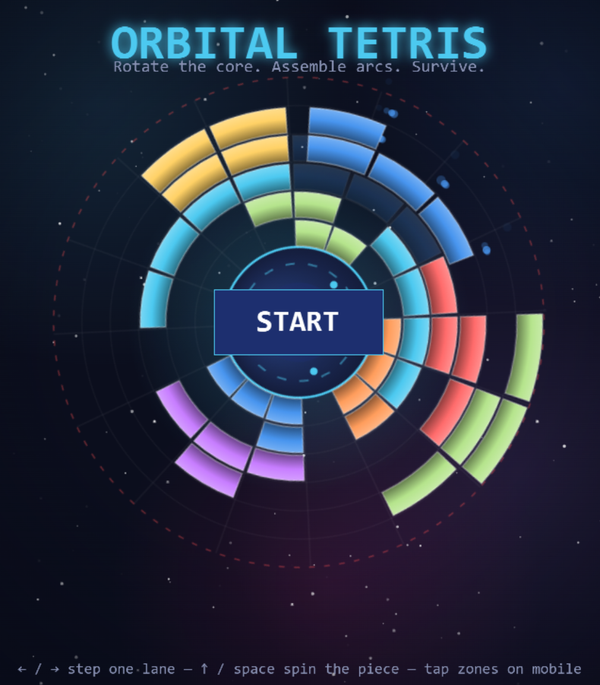

# Orbital Tetris

Circular Tetris built with [Excalibur.js](https://excaliburjs.com), TypeScript and Vite
(based on the [template-ts-vite](https://github.com/excaliburjs/template-ts-vite) setup).



The seven classic tetrominoes — rounded into ring-segment cells that fit the circle —
fly from the edges of the screen toward a living core. They bind to the core on contact,
stacking outward ring by ring. Rotate the core so pieces land where you want, spin the
pieces to fit: a fully assembled ring disappears and scores points. If a stack grows
past the dashed boundary, the run is over.

## Controls

| Input | Action |
| --- | --- |
| `←` / `→` or `A` / `D` | Step the core (and all bound cells) one lane; hold to repeat |
| `↑` / `W` | Spin the falling piece closest to the core |
| `↓` / `S` (hold) | Soft drop — the piece closest to the core falls faster and locks sooner |
| `Space` | Hard drop — slam the piece closest to the core onto its ghost and lock it |
| `M` | Toggle sound |
| Gamepad | D-pad / left stick step the core, `A` spins, `B` hard-drops, D-pad down soft-drops |
| Hold lower left / right of the screen | Step the core (mobile) |
| Tap the top of the screen | Spin the piece (mobile) |

## Rules

- Pieces travel radially inward, rigid, and rest on first contact. A short grace
  window before they lock lets you step or spin at the last moment to intertwine
  pieces — overhangs leave holes underneath, exactly like classic Tetris.
- Near the core, pieces brake and the grace window grows: deep in the well there
  is no stack to warn you, so there is extra time to step the lane sideways.
- A lane step (or spin) is blocked when it would sweep the construction through
  a piece that is already deeper than the destination lane's surface — pieces
  can never be bounced back outward to stall them forever.
- A translucent ghost always shows the exact cells the piece will lock into
  (it turns red when locking there would end the run).
- **Clearing**: any contiguous occupied arc of 6+ cells in one ring disappears —
  the circular equivalent of a line. A complete 16-cell ring scores double, and
  clearing several arcs at once multiplies the total. Cells outward of a cleared
  cell slide one ring inward.
- Scoring: 20 points per locked piece, 15 points per cleared cell (×2 for a full
  ring, ×N for N simultaneous arcs). Consecutive clearing locks build a combo
  multiplier, and arcs joined by the inward collapse chain as cascades.
- Special pieces: from level 4, **golden** tetrominoes are worth a ×5 lock
  bonus; from level 8, single-cell **bombs** blast the 3×3 polar patch where
  they land instead of binding.
- 100 levels: piece speed, spawn rate, concurrent pieces and arcs required all
  ramp up. Speed only changes when a new level starts.
- Game over when a piece would lock beyond the field boundary. Then: **Continue** (retry
  the current level, keeping your score), **Try Again** (back to level 1) or **Main Menu**.

## Development

```bash
npm install
npm run dev      # dev server with HMR
npm run build    # type-check (strict) + production build to dist/
npm run preview  # serve the production build
```

## Architecture

- `src/constants.ts` — every game constant in one place
- `src/types.ts` — shared interfaces (grid, pieces, levels, scene-transition data)
- `src/pieces.ts` — the 7 tetrominoes on the polar lattice + 90° rotation
- `src/grid.ts` — pure polar-grid logic: surfaces, piece locking, full-ring detection, collapse
- `src/levels.ts` — the 100-level difficulty curve
- `src/field.ts` — playfield controller: spawning, rotation, locking, clears, scoring
- `src/actors/` — core visual, wedge cells, falling pieces, starfield background
- `src/fx/` — particles (bursts, trails, popups, shockwaves) and palette helpers
- `src/ui/` — HUD labels and auto-sizing buttons
- `src/scenes/` — menu (self-playing attract mode), game, game over

The playfield is a polar grid: 16 sectors × 6 rings around the core. Cells render as
annular-sector wedges so the construction tiles the circle. The core actor rotates in
lane steps; bound wedges are children of it in local polar coordinates, while falling
pieces fly in world space along fixed radial paths — which is why stepping the core
changes where they land. Falling cells are drawn in the true field polar frame: each
cell sits exactly in the lane and at the radius it currently occupies, with its wedge
sized for that radius — pieces arrive as ring chunks that shrink as they converge and
attach with no visual snap.
